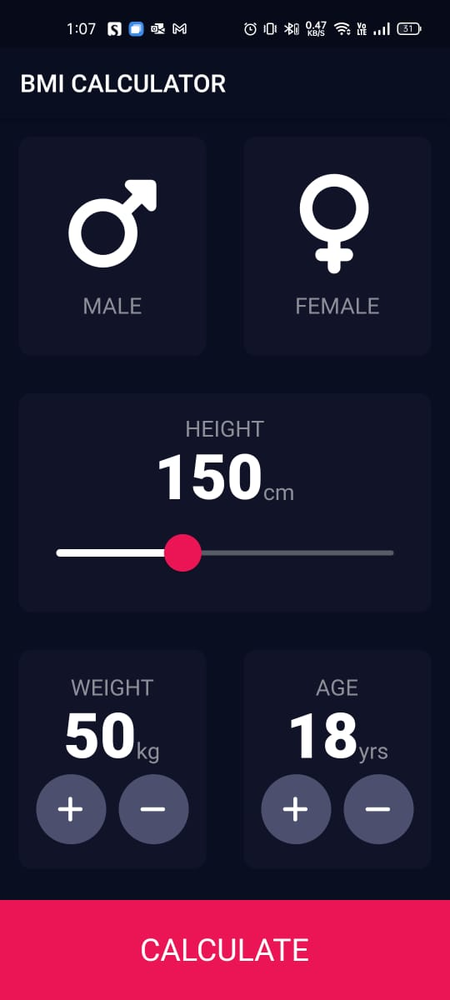

# BMI Calculator App
The BMI Calculator App is a simple mobile application built using the Flutter framework. This app helps users calculate their Body Mass Index (BMI) based on their weight and height. The BMI is a measure of body fat based on the height and weight of an individual.

# Features
* The app provides the following features:

  * Input Fields: The app allows the user to input their weight and height in either imperial.

  * BMI Calculation: Once the user enters their weight and height, the app calculates the BMI using the standard BMI formula: BMI = weight (kg) / (height (m))^2.

# Getting Started
To get started with the BMI Calculator App, simply download and install the app on your Android or iOS device. Once the app is installed, launch it and enter your weight and height in either metric or imperial units. The app will calculate your BMI and provide you with the corresponding BMI category and recommendations.

# Requirements
To use the BMI Calculator App, you need an Android or iOS device running the latest version of the operating system.

# Feedback
If you encounter any issues while using the app, please feel free to open a issue in GitHub.

# Screenshots

